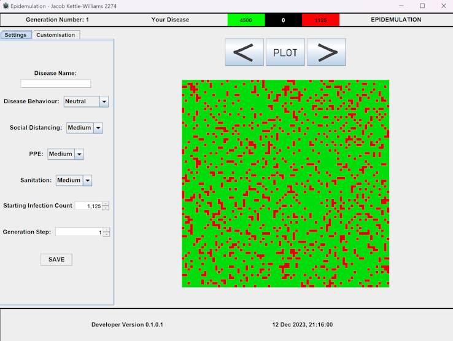

# Epidemulation

A-Level Project 2021

## What is Epidemulation?

Epidemulation was the first GUI + Java project that I made, which was for my A-Level Computer Science project. Aimed at being a tool for study, it ended up being closer to John Conway's Game of Life than a simulation of a pandemic. In fact, during the development process I implemented the Game of Life as a test to see if I could make it work.

## How does it work?

The program is made using the JSwing library, as well as the JFreeChart library for the graphing. Being my first ever Java project, I was new to Object-Oriented Programming, and so the code is not as efficient as it could be. 

## Changes

1. Maven Implementation
   - Converted structure to follow Maven, so that the JFreeChart library can be used
   - Updated image locations and references 